# Trigger Map: Instant Wiki

> Visual strategic overview connecting business goals to user psychology

**Created:** 2026-06-08  
**Author:** raja  
**Methodology:** Based on Effect Mapping (Balic & Domingues), adapted for WDS framework  

---

## Strategic Documents

This is the visual strategic hub. For detailed documentation, see:

- **Business Strategy:** [_progress/00-design-log.md](../_progress/00-design-log.md) - Full milestones and design logs
- **Primary Target Profile:** [02-clara-the-compiler.md](personas/02-clara-the-compiler.md) - Clara the Compiler (Academic Researcher)
- **Secondary Target Profile:** [03-dan-the-developer.md](personas/03-dan-the-developer.md) - Dan the Developer (Software Engineer)
- **Tertiary Target Profile:** [04-sarah-the-strategist.md](personas/04-sarah-the-strategist.md) - Sarah the Strategist (Startup Product Manager)
- **Strategic Implementation:** [feature-impact-analysis.md](feature-impact-analysis.md) - Prioritized features with impact scores

---

## Vision

*"Empower researchers, developers, and writers to effortlessly transform raw documents into beautifully structured, searchable, and shareable knowledge portals, establishing Instant Wiki as the primary choice for self-publishing digital knowledge bases."*

---

## Business Objectives

### Objective 1: Performance Focus
- **Metric:** AI processing and site building completion time for standard document sets (up to 50 pages).
- **Target:** 95% of standard sets complete in under 30 seconds.
- **Timeline:** Launch day.

### Objective 2: Activation Focus
- **Metric:** User Activation Rate (percentage of registered users who create a wiki and upload at least one source file).
- **Target:** 60% activation rate.
- **Timeline:** Within first 30 days of launch.

### Objective 3: Engagement Focus
- **Metric:** Average generated pages and source uploads per active wiki.
- **Target:** 15 generated pages and 3 source documents.
- **Timeline:** End of Q3 2026.

### Objective 4: Virality & Sharing Focus
- **Metric:** Public wiki views and organic homepage referral rate via branding.
- **Target:** 10,000 public pageviews and 5% referral conversion.
- **Timeline:** Within 6 months of public release.

---

## Target Groups (Prioritized)

### 1. Clara the Compiler (Primary Focus)
**Priority Reasoning:** Clara has the most rigorous document constraints, formatting density, and accuracy requirements. Solving for Clara's needs forces us to build a robust, citation-accurate extraction engine and clean layouts.
> *PhD candidate overwhelmed by research papers scattered across Zotero and her desktop, looking for a structured visual map of literature.*

*   **Key Positive Drivers:** Connection Discovery, Advisor Impression, Zero-Coding Setup.
*   **Key Negative Drivers:** Academic Errors (Hallucinations), Organization Fatigue, Time-Sink Setup.

### 2. Dan the Developer (Secondary Focus)
**Priority Reasoning:** Dan is our primary virality and social distribution vehicle. Delighting Dan encourages public sharing and organic homepage referral traffic.
> *Software engineer and hobbyist who maintains a large vault of markdown notes, wanting to publish a visual digital garden portfolio.*

*   **Key Positive Drivers:** Social Proof/Resume Asset, Dynamic Graph Navigation, Frictionless Markdown Import.
*   **Key Negative Drivers:** Cheap "AI Wrapper" Stigma, Platform Lock-in, Slow Performance.

### 3. Sarah the Strategist (Tertiary Focus)
**Priority Reasoning:** Sarah represents our B2B commercial feasibility and future subscription model, but requires complex access controls that can be prioritized later.
> *Startup Product Manager conducting competitor audits and user research, wanting a searchable single source of truth for her team.*

*   **Key Positive Drivers:** Team Search Adoption, Traceable Trust, Single Source of Truth.
*   **Key Negative Drivers:** Confidential IP Leakage, Formatting Cleanup, Tool Abandonment.

---

## Trigger Map Visualization

```mermaid
%%{init: {'theme':'base', 'themeVariables': { 'fontFamily':'Inter, system-ui, sans-serif', 'fontSize':'13px'}}}%%
flowchart LR
    %% Business Objectives
    BG0["<br/>⚡ Obj 1: Speed<br/>95% builds under 30s<br/>"]
    BG1["<br/>📈 Obj 2: Activation<br/>60% activation rate<br/>"]
    BG2["<br/>🔄 Obj 3: Engagement<br/>15 pages & 3 sources avg<br/>"]
    BG3["<br/>📣 Obj 4: Virality<br/>10k views, 5% referrals<br/>"]
    
    %% Platform Core
    PLATFORM["<br/>🌐 Instant Wiki<br/><br/>Notion + Wikipedia + Obsidian Publish<br/>Turn documents into websites<br/><br/>"]
    
    %% Target Groups
    TG0["<br/>🎓 Clara the Compiler<br/>(Primary Target)<br/>Academic Researcher<br/>"]
    TG1["<br/>💼 Dan the Developer<br/>(Secondary Target)<br/>Software Engineer<br/>"]
    TG2["<br/>🏠 Sarah the Strategist<br/>(Tertiary Target)<br/>Startup PM<br/>"]
    
    %% Driving Forces
    DF0["<br/>🎓 Clara's Drivers<br/><br/>WANTS<br/>✅ Connection Discovery<br/>✅ Advisor Impression<br/>✅ Zero Code Publishing<br/><br/>FEARS<br/>❌ AI Hallucinations<br/>❌ Setup Time Sink<br/>❌ Organization Fatigue<br/>"]
    DF1["<br/>💼 Dan's Drivers<br/><br/>WANTS<br/>✅ Resume Asset<br/>✅ Dynamic Graph Navigation<br/>✅ Frictionless MD Import<br/><br/>FEARS<br/>❌ AI Wrapper Stigma<br/>❌ Content Lock-in<br/>❌ Slow Performance<br/>"]
    DF2["<br/>🏠 Sarah's Drivers<br/><br/>WANTS<br/>✅ Team Search Adoption<br/>✅ Traceable Trust<br/>✅ Single Source of Truth<br/><br/>FEARS<br/>❌ Confidential IP Leak<br/>❌ Formatting Cleanup<br/>❌ Tool Abandonment<br/>"]

    %% Connections
    BG0 --> PLATFORM
    BG1 --> PLATFORM
    BG2 --> PLATFORM
    BG3 --> PLATFORM
    
    PLATFORM --> TG0
    PLATFORM --> TG1
    PLATFORM --> TG2
    
    TG0 --> DF0
    TG1 --> DF1
    TG2 --> DF2

    %% Styling
    classDef businessGoal fill:#f3f4f6,color:#1f2937,stroke:#d1d5db,stroke-width:2px
    classDef platform fill:#e5e7eb,color:#111827,stroke:#9ca3af,stroke-width:3px
    classDef targetGroup fill:#f9fafb,color:#1f2937,stroke:#d1d5db,stroke-width:2px
    classDef drivingForces fill:#f3f4f6,color:#1f2937,stroke:#d1d5db,stroke-width:2px
    
    class BG0,BG1,BG2,BG3 businessGoal
    class PLATFORM platform
    class TG0,TG1,TG2 targetGroup
    class DF0,DF1,DF2 drivingForces
```

---

## Design Focus Statement

**Design Focus Strategy (MoSCoW):**

*   **Primary Design Target:** Clara the Compiler (Academic Researcher)
*   **Secondary Design Target:** Dan the Developer (Software Engineer)

### MUST Address (Launch Critical)
1.  **AI Trust & Traceability:** Wiki pages must show clear citation references back to exact source text/PDF lines to eliminate hallucination fears (*Clara's top anxiety*).
2.  **Frictionless Creation (Zero Config):** Uploading files and obtaining a live website with a generated name/slug must require zero coding or SSG configuration (*Clara/Dan's top positive driver*).
3.  **Anti-Chatbot Layout:** The layout must look like a premium structured wiki publication (Notion + Wikipedia + GitBook), completely avoiding the cheap "AI chatbot bubble" aesthetic (*Dan's top anxiety*).

### SHOULD Address (Key Differentiators)
1.  **Visual Connections:** An interactive mini-graph preview and full-screen Graph Page to visualize concept relationships (*Clara/Dan's positive driver*).
2.  **Visibility Controls:** Private/Unlisted/Public status badges and settings toggles (*Sarah's fear of corporate IP leakage*).

### COULD Address (Future Polish)
1.  **Global search across all documents** (*Sarah's PM research driver*).
2.  **Clean Markdown export option** to eliminate vendor lock-in anxiety (*Dan's negative driver*).

---

## Cross-Group Patterns

### Shared Drivers
*   **Frictionless Website Creation:** Everyone wants a custom knowledge website, but no one wants to build one or write code for it. The transition from documents to site must be instant.
*   **Traceability & Trust:** Clara (academic accuracy) and Sarah (team trust) both need clear links back to the original source PDFs to trust the AI's output.

### Unique Drivers
*   **Virality vs. Privacy:** Dan wants public exposure and easy social sharing to Twitter/GitHub. Sarah and Clara need private/unlisted wiki controls to protect research and corporate IP.

### Potential Tensions
*   **Aesthetics vs. Speed:** Clara and Sarah want fast processing, but the resulting site must look professional (Merriweather typography, clean sidebar) to avoid looking like cheap AI-generated garbage.

---

## Next Steps

This Trigger Map Poster provides a quick reference. For detailed work:

- [x] **Review detailed docs** - See `personas/02-clara-the-compiler.md` and others.
- [ ] **Analyze Feature Impact** - Review `feature-impact-analysis.md` to scope the Next.js database tables and route actions.
- [ ] **Guide UX Design** - Proceed to Phase 4: UX Design to sketch components conforming to these psychological triggers.

---

_Generated with Whiteport Design Studio framework_  
_Trigger Mapping methodology credits: Effect Mapping by Mijo Balic & Ingrid Domingues (inUse), adapted with negative driving forces_
