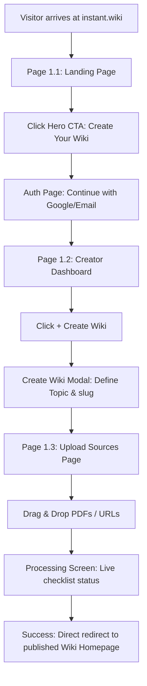

# 01-creator-onboarding

**Project:** Instant Wiki  
**Created:** 2026-06-08  
**Method:** Whiteport Design Studio (WDS)

---

## Scenario Overview

**User Journey:** A researcher, writer, or developer visits the landing page, authenticates with their Google/Email account, lands on the dashboard, creates a new wiki with an AI-generated name and slug, and drags in their first document sources, watching the live extraction build their new website.

**Entry Point:** `instant.wiki` landing page.  
**Success Exit:** Live Wiki Homepage with generated pages and concepts.  
**Alternative Exits:** Error during document parsing, cancellation of wiki creation.

**Target Personas:**
- **Clara the Compiler (Primary):** Needs a seamless, zero-config way to go from research PDFs to a formatted wiki.
- **Dan the Developer (Secondary):** Seeks an impressive landing page and fast, clean dashboard.

---

## Pages in This Scenario

| Page # | Page Name | Status | Purpose |
| ------ | ----------- | ---------------- | --------------- |
| 1.1  | Landing Page | specified | Attract users, show example wiki with dynamic graph. |
| 1.2  | Creator Dashboard | specified | List existing wikis and open the Create Wiki modal. |
| 1.3  | Upload & Processing | specified | Drag-and-drop sources and watch live concept extraction. |

---

## User Flow



---

## Scenario Steps

### Step 1: Discover & Preview
**Page:** 1.1-Landing-Page  
**User Action:** Clicks "Create Your Wiki" or interacts with the Machine Learning Atlas graph demo.  
**System Response:** Redirects user to authentication screen.  
**Success Criteria:** User initiates signup.

### Step 2: Access Dashboard & Initiate Wiki
**Page:** 1.2-Creator-Dashboard  
**User Action:** Clicks `+ Create Wiki`, enters topic "Bioinformatics Research", generates names, reviews URL preview, selects visibility Public, and clicks "Create".  
**System Response:** Creates wiki record and redirects user to the empty upload screen.  
**Success Criteria:** Wiki record created with slug `clara/bioinformatics-research`.

### Step 3: Upload Sources & Process
**Page:** 1.3-Upload-Processing  
**User Action:** Drags `GenomicsAnalysis.pdf` into the uploader and hits upload.  
**System Response:** Displays live extraction step checklist (Text Extraction $\to$ Finding Concepts $\to$ Discovering Relationships $\to$ Generating Pages) and redirects to the final Wiki Homepage.  
**Success Criteria:** 100% extraction completion and redirect to `/u/clara/bioinformatics-research`.

---

## Trigger Map Connections

### Positive Drivers Addressed
- **Zero Coding Setup (Clara/Dan):** Setup takes 3 clicks (Create Wiki -> Name Generator -> Upload).
- **Anti-Chatbot Layout (Dan):** Dashboard and modals focus on building structured site assets.

### Negative Drivers Avoided
- **AI Wrapper Stigma (Dan):** The clean developer-centric layout avoids chat box widgets.
- **Confidential IP Leakage (Sarah):** Explicit private/unlisted selector in the creation modal.

---

## Success Metrics

**Primary Metric:** Time-to-First-Wiki (time between registration and redirect to finished Wiki Homepage). Goal: < 2 minutes.

**Secondary Metrics:**
- **Activation Conversion:** Percentage of signups completing Step 3.
- **AI Suggestion Usage:** Percentage of users who click "Generate AI Names" rather than typing a slug manually.

---

## Edge Cases & Error Handling

| Edge Case | How Handled | Page(s) Affected |
| ----------------------- | ------------------- | ----------------- |
| Document upload fails due to corrupted PDF | Display "Failed to extract text" inline error in the upload component with retry action. | Page 1.3 |
| Desired slug already taken | Validate slug availability asynchronously during name selection; show "Slug already taken" error below preview. | Page 1.2 Modal |

---

## Technical Requirements

### Data Flow
```
Landing Page → Supabase Auth → Dashboard → Create Wiki Action (insert DB) → File Upload to Supabase Storage → Trigger Edge function for AI Processing → Redirect to Wiki Homepage
```

---

## Design Assets

**Scenario Folder:** `_bmad/wds/C-UX-Scenarios/01-creator-onboarding/`

**Page Specifications:**
- `pages/1.1-landing-page/landing-page.md`
- `pages/1.2-creator-dashboard/creator-dashboard.md`
- `pages/1.3-upload-processing/upload-processing.md`

---

_Created using Whiteport Design Studio (WDS) methodology_
