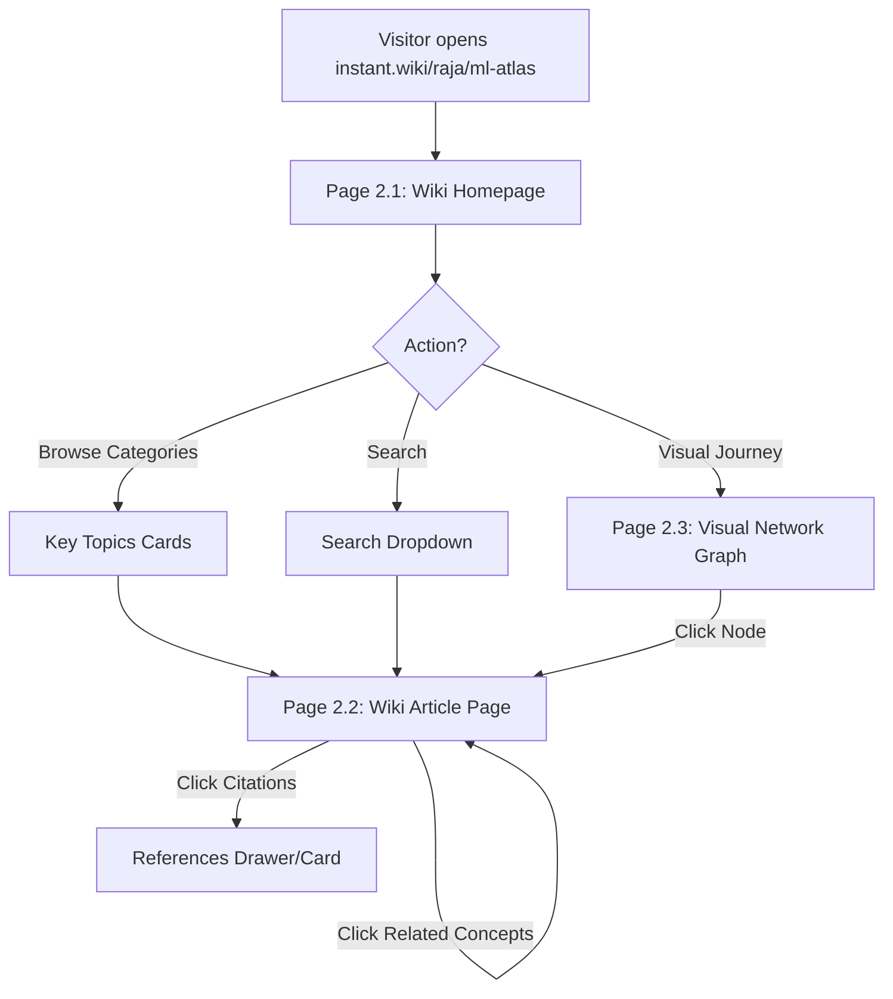

# 02-reader-portal

**Project:** Instant Wiki  
**Created:** 2026-06-08  
**Method:** Whiteport Design Studio (WDS)

---

## Scenario Overview

**User Journey:** A reader (e.g. Clara's advisor, Dan's social media follower, or Sarah's team member) accesses a published wiki. They land on the Wiki Homepage to view the AI summary, browse key topics, search for specific terms, and click concept links to read full article pages (using high-quality Merriweather typography and grounded citations) or explore the visual network graph of all connected ideas.

**Entry Point:** `instant.wiki/[username]/[wiki_slug]` (Public) or `/u/[username]/[wiki_slug]` (Owner View).  
**Success Exit:** User navigates between multiple articles, uses search successfully, and interacts with the full-screen concept graph.  
**Alternative Exits:** Page not found (invalid slug), unauthorized access (private wiki).

**Target Personas:**
- **Clara the Compiler (Primary):** Needs high-trust citation references on article pages to verify information.
- **Dan the Developer (Secondary):** Wants a visually stunning, responsive network graph view and clean text.
- **Sarah the Strategist (Tertiary):** Needs robust search to find facts across multiple documents.

---

## Pages in This Scenario

| Page # | Page Name | Status | Purpose |
| ------ | ----------- | ---------------- | --------------- |
| 2.1  | Wiki Homepage | specified | Strategic overview hub of a wiki, listing key metrics, summaries, and graph preview. |
| 2.2  | Wiki Article Page | specified | Render markdown articles with serif type, concept connections, and PDF citations. |
| 2.3  | Visual Network Graph | specified | Full-screen interactive zoom/pan concept mapping tool. |

---

## User Flow

---

## Scenario Steps

### Step 1: Arrive & Overview
**Page:** 2.1-wiki-homepage  
**User Action:** Arrives at `/u/raja/ml-atlas`. Reads the AI summary card and scans the stats count (25 Pages, 103 Relationships).  
**System Response:** Loads the wiki overview and renders the mini interactive concept graph preview.  
**Success Criteria:** Key metadata and topics loaded in < 500ms.

### Step 2: Read Article
**Page:** 2.2-wiki-article  
**User Action:** Clicks the "Statistics" category card or searches "Bayesian Methods", opening the "Statistics" article page.  
**System Response:** Renders the article with Merriweather font, showing summary card, core content, related concept links, and PDF references at the bottom.  
**Success Criteria:** Article body renders formatted markdown; citation numbers point to verifiable PDF sources.

### Step 3: Explore Graph
**Page:** 2.3-network-graph  
**User Action:** Clicks "Graph" in the sidebar navigation to open the full-screen view. Pans around, zooms in on "Deep Learning", and clicks the node.  
**System Response:** Displays the full interactive node map. Clicking "Deep Learning" navigates to `/u/raja/ml-atlas/deep-learning`.  
**Success Criteria:** Graph canvas supports smooth 60fps zooming and panning.

---

## Trigger Map Connections

### Positive Drivers Addressed
- **Connection Discovery (Clara):** Interactive graph view maps concept overlaps dynamically.
- **Social Proof / Portfolio (Dan):** High-end presentation look makes Dan proud to share this.
- **Traceable Trust (Sarah/Clara):** Inline references link assertions back to actual document paragraphs.

---

## Success Metrics

**Primary Metric:** Session Pageviews (average number of articles/graph actions per reading session). Goal: > 4.5 actions.

**Secondary Metrics:**
- **Search Click-Through:** Percentage of searches resulting in an article click.
- **Graph Node Interaction:** Percentage of users who click a node in the graph view.

---

## Technical Requirements

### Client-Side Graph Library
- D3.js or Vis.js wrapper optimized for SVG/Canvas rendering to ensure 60fps performance on standard viewports.
- Responsive container resizing.

---

_Created using Whiteport Design Studio (WDS) methodology_
