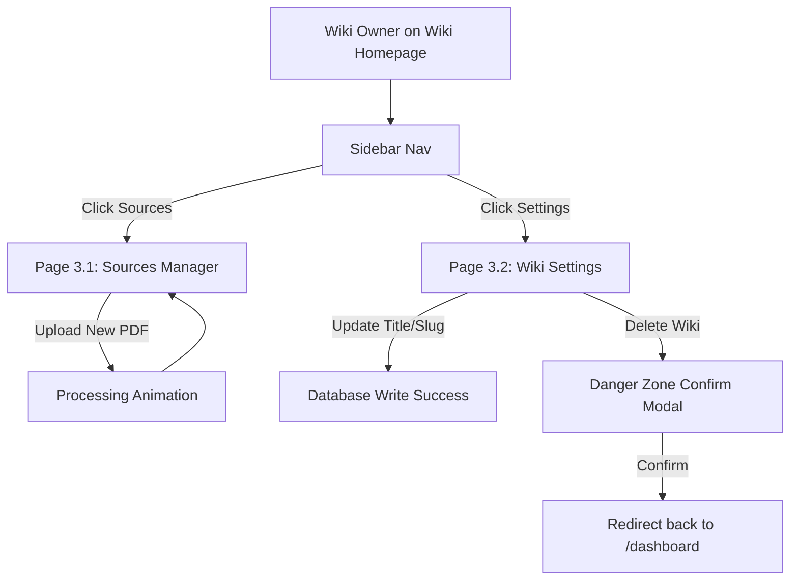

# 03-wiki-management

**Project:** Instant Wiki  
**Created:** 2026-06-08  
**Method:** Whiteport Design Studio (WDS)

---

## Scenario Overview

**User Journey:** The wiki owner (e.g., Clara or Dan) accesses their wiki's dashboard to manage uploaded files and check strategic metrics (how many pages were generated, which concepts were extracted from which source, and overall account billing limits) or update basic wiki attributes like Title, Slug, Visibility (Private/Public), or perform deletions.

**Entry Point:** Navigation links inside the wiki sidebar.  
**Success Exit:** User updates settings successfully or reviews source statistics.  
**Alternative Exits:** Deleting the wiki (redirects to dashboard).

**Target Personas:**
- **Clara the Compiler (Primary):** Needs to see which PDFs are contributing to which pages (transparency check).
- **Sarah the Strategist (Tertiary):** Needs to set wikis to private/unlisted and check team usage limits.

---

## Pages in This Scenario

| Page # | Page Name | Status | Purpose |
| ------ | ----------- | ---------------- | --------------- |
| 3.1  | Sources Manager | specified | Lists uploaded sources with metrics (pages generated, concepts found) and lets users upload additional files. |
| 3.2  | Wiki Settings | specified | Configures wiki title, slug, visibility settings, and deletion controls. |

---

## User Flow

---

## Scenario Steps

### Step 1: Manage Sources
**Page:** 3.1-sources-manager  
**User Action:** Clicks "Sources" in the sidebar. Views uploaded PDFs list.  
**System Response:** Loads list showing pages/concepts statistics per document. Shows uploader drag-box at top.  
**Success Criteria:** Source document lists load with correct metadata metrics.

### Step 2: Configure Wiki Settings
**Page:** 3.2-wiki-settings  
**User Action:** Clicks "Settings" in the sidebar. Changes Visibility from Public to Private and hits Save.  
**System Response:** Updates the wiki record visibility in the database.  
**Success Criteria:** DB record successfully updated, badge displays PRIVATE.

---

## Trigger Map Connections

### Positive Drivers Addressed
- **Traceable Trust (Sarah/Clara):** Lists pages generated and concepts found per document to build factual transparency.
- **Privacy Controls (Sarah):** Private/Unlisted/Public settings toggles to avoid IP leaks.

---

## Success Metrics

**Primary Metric:** Settings Update Success (percentage of settings actions completed without layout errors).

**Secondary Metrics:**
- **Delete Wiki Cancellations:** Percentage of users who open the delete modal but cancel the action.
- **Incremental uploads:** Number of new source documents added to an existing wiki.

---

_Created using Whiteport Design Studio (WDS) methodology_
